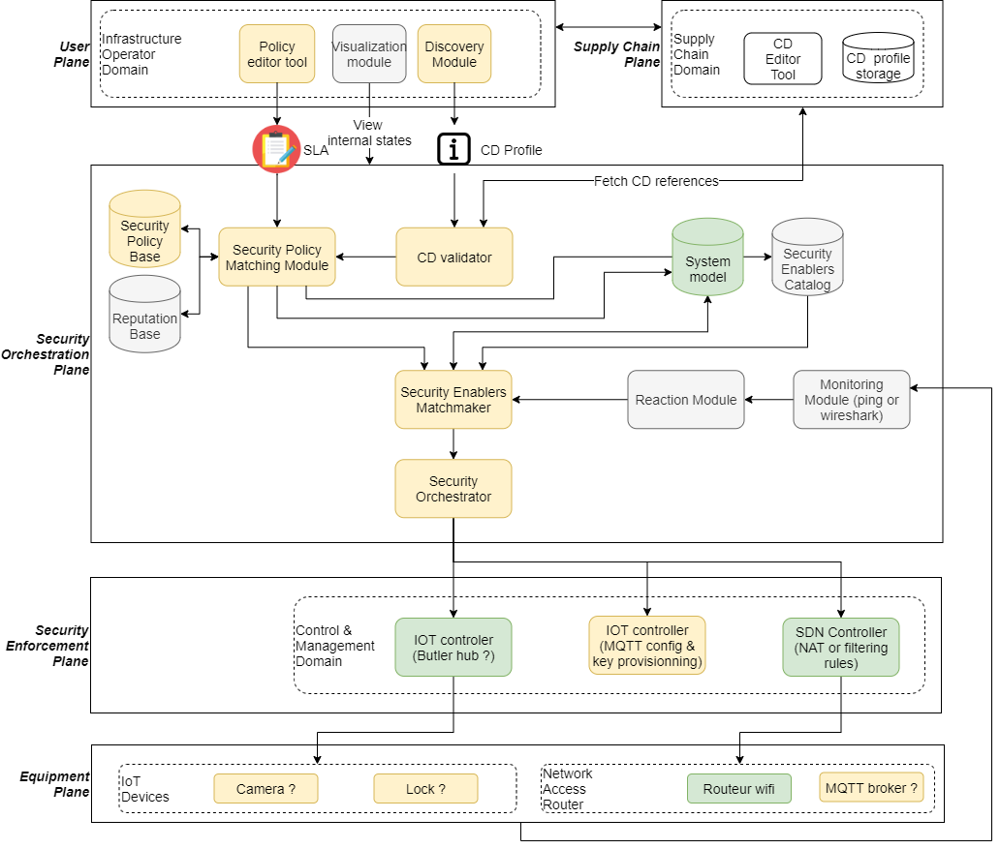
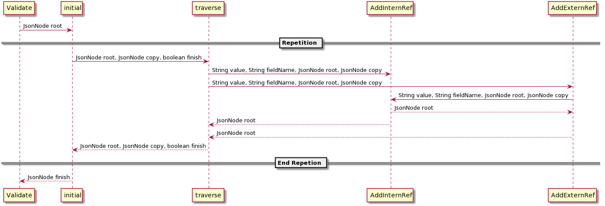
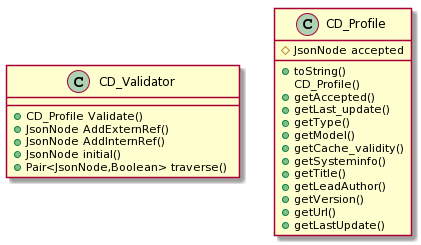

# Schéma fonctionnel cible
Le TIM manager sera composé :
1. d'un front end qui permettra à l'administrateur de l'infrastructure d'accéder aux opérations matérialisées dans la couche "User Plane"
2. d'un back end qui réalisera les différentes opérations d'administration 

# Vue générale des modules
"Discovery Module" : gère les nouveaux _équipements dans le système_, il récupère le fichier _CD_ avec l'URL ou identifiant t le transfère au "CD Validator". _Dans un premier temps, ce module sera doté d'une interface graphique permettant une saisie manuelle de l'URL ou de l'identifiant._ 

"CD CD Validator" : vérifie que le profil CD est correct. Cela consiste en 2 tâches:
1. vérifier si le fichier MUD est conforme, c'est-à-dire s'il respecte les critères que l'on demande d'un fichier MUD (champs obligatoires, bon type des données),
2.  vérifier la signature de ce fichier (à faire plus tard dans le projet)
3. Si le MUD est correct, envoie des informations de celui-ci au "Security Policy Matching Module" (fichier direct ou class ou autre ?).

"Security Policy Matching Module" : Vérifie si l'objet correspond à la politique de sécurité mise en place sur le réseau qu'il veut intégrer. Pour cela, il interroge l'ontologie "Security Policy Base". Elle lui renvoie un indice de confiance de l'objet. Si c'est bon, envoie cette information à "Security Enablers Matchmaker".

"Security Enablers Matchmaker" : Vérifie les besoins de sécurité de l'objet. Regarde également quelles sont les fonctionnalités de l'objet (les fonctions qu'ils possèdent). Ces informations seront transmises à des bases de données. Cette action permettra de renseigner au réseau quels sont les fonctions disponibles et sur quel objet. Le but est de pouvoir "combler" un manque d'un objet par l'utilisation d'une autre fonction qui lui transféra le résultat de celle-ci.

"Security Orchestrator" : Définit qui doit effectuer l'ordre donné (IOT controller, SDN controller). 

# Composition du back end

Le back end sera un web service réalisé avec le framework Play. Il contiendra une classe Controller qui sera le point d'entrée du web service. Le contrôleur est en charge d'animer les différents échanges entre les modules. 

## Module CD Validator
Le module CD Validator sera constitué des classes suivantes:
1. CD_Validator : la classe qui réalise l'opération de validation du profil CD. Si la validation échoue, elle renvoie une exception qui doit être traitée par le CD_Controller pour répondre avec un code erreur. Si la validation réussit, CD_Validator crée un objet de type CD_Profile et l'envoie au "CD_Controller".
2. CD_Profile : classe contenant le json désérialisé et quelques méthodes get permettant d'accéder au contenu. Éventuellement, les données de header peuvent être stockés dans des paramètres.

TODO Proposer un diagramme de classe UML à partir des fichiers json et de la définition du manifest . Attention, dans le fichier json, dans API par exemple, on peut avoir 2 modèles différents (lwm2m ou openapi

# Diagramme de séquence
## Validation d'un CD_Profile

