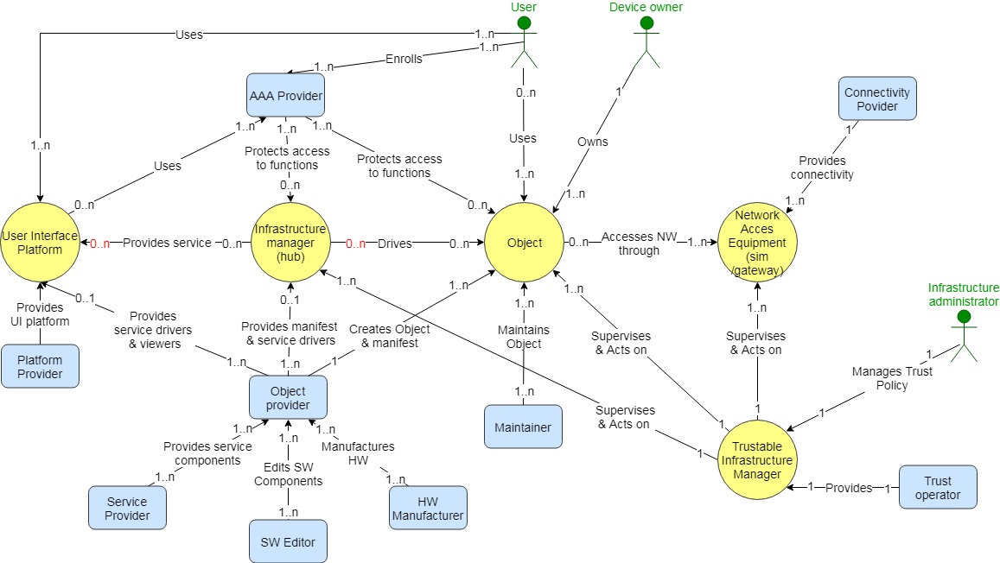

# Users description

* User
* Infrastructure administrator
* Component provider
* Component owner
* CSP or Connectivity Service Provider
* Trust operator

# User Story 1
**As** an infrastructure administrator,  
**I want to** add/delete/modify security policy rules  
**so that** I am able to configure its security requirements or intents for the system.

# User Story 2
**As** a user or infrastructure administrator,  
**when** I add a component to the system,  
**I want** TIM to control its adequacy with the security policy and decides wether to include it & under which in the system & under which conditions,  
**so that** the system's security / trust level is maintained.

# User Story 3
**As** a user or insfrastructure administrator,  
**when** I add to the system a component which requires some additional security functions,  
**I want** to select a match among a selection recommended by TIM,  
**so that** the component provides the service under the conditions intended by its provider and those described by the infrastructure administrator.

# User Story 4
**As** a user or insfrastructure administrator,  
**when** I select a match,  
**I want** TIM to set up and configure the communication link between the security function provider and client,  
**so that** the component provides the service under the conditions intended by its provider and those described by the infrastructure administrator.

# User Story 5
**As** an insfrastructure administrator,   
**I want** TIM to show the network topology,  
**so that** I visualize the system and its components.

# User Story 6
**As** an insfrastructure administrator,   
**I want** TIM to calculate a trust score or reputation for each component in real time,  
**so that** I visualize information about the status of system and of each component.

# To be noted
* Today, the component is a connected device, i.e. a combination of 1 hardware & 0 or more physical functions